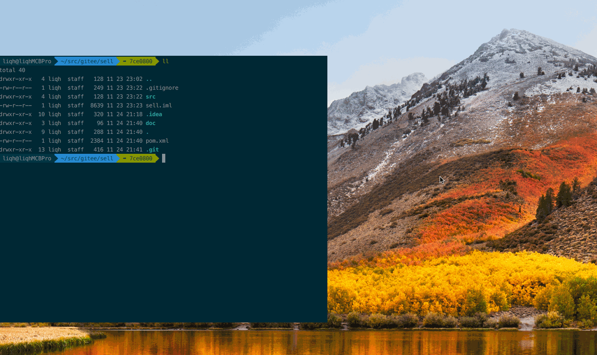

效果


## 参考
[iTerm2 Oh-my-zsh配置与agnoster主题配置](https://wangwang4git.github.io/blog/2017/04/22/iterm2-oh-my-zsh-config-and-agnoster-theme-config/)
## zsh与bash相互切换
 ```
 echo $SHELL       #显示当前shell
 chsh -s /bin/zsh  #bash到zsh  -s表示尝试切换，可能不成功
 chsh -s /bin/bash #zsh到bash
 ```

## 安装item2
[下载iTerm2](http://www.iterm2.com/)

### 简单配置item2
达到`⌘+.`弹出item2  

⌘, 打开配置  >> Profiles >> 先复制Default,再选中复制出的Profile"Copy Of Default" >> Keys >> Configure Hotkey window >>  
在弹出的窗口中点先HotKey，然后按`⌘.`

### 安装Solarized配色方案
[altercation在这里](https://github.com/altercation/solarized)
下载解压，iTerm2设置->Profiles->Colors->Color Presets->Import...->选择解压后的solarized/iterm2-colors-solarized即可

## 安装zsh
查看是否安装zsh，执行`cat /etc/shells`如果有显示`/bin/zsh`说明默认已安装
```shell
cat /etc/shells
# List of acceptable shells for chpass(1).
# Ftpd will not allow users to connect who are not using
# one of these shells.

/bin/bash
/bin/csh
/bin/ksh
/bin/sh
/bin/tcsh
/bin/zsh
```
如果未安装用`brew install zsh`来安装

## 安装Oh My Zsh
[官网](http://ohmyz.sh/)
通过`curl`安装
```
sh -c "$(curl -fsSL https://raw.github.com/robbyrussell/oh-my-zsh/master/tools/install.sh)"
```

## 设置Oh My Zsh主题
[选择主题在这里](https://github.com/robbyrussell/oh-my-zsh/wiki/Themes) 

## 设置zsh主题agnoster
[参考](https://github.com/agnoster/agnoster-zsh-theme)
1. [安装Powerline对应的字体库](https://github.com/powerline/fonts)  
安装后进入iTerm2设置-Profiles-Text-Font，选择Powerline字体：`12pt Meslo LG S DZ Regular for Powerline`  

然后执行(一定要在item2中先选择power的字体)> echo "\ue0b0 \u00b1 \ue0a0 \u27a6 \u2718 \u26a1 \u2699"  
显示这样说明字体没有问题


2. 最后一步
```
vi ~/.zshrc
#ZSH_THEME="robbyrussell"
ZSH_THEME="agnoster"

source ~/.zshrc
```


